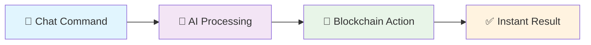

# ZAP 🚀
## AI-Powered Blockchain Agent for Core Network

> Transform blockchain interactions with simple chat commands. Deploy contracts, send tokens, create NFTs - all with natural language.

[](https://coredao.org/)
[](https://ai.google.dev)
[](https://nextjs.org)

---

## ✨ What Makes ZAP Special?

| 🤖 **AI-First** | 💰 **One Command** | 🔐 **Secure** |
|:---:|:---:|:---:|
| Chat with your blockchain | Deploy contracts instantly | Military-grade encryption |
| Natural language processing | Create tokens & NFTs | Secure credential system |
| Smart transaction routing | Automated salary payments | Premium subscription model |

## 🎯 Core Features

### 💬 Smart Chat Interface
```
You: "Send 100 tCORE2 to alice"
ZAP: ✅ Sent! Hash: 0xabc123...
```
- Natural language commands
- Voice & text input
- Context-aware processing

### ⚡ One-Command Operations
```
You: "Create CoreDoge token, 1B supply"
ZAP: 🚀 Token deployed! Contract: 0xdef456...
```
- Deploy smart contracts instantly
- Create tokens & NFT collections
- Automated transaction processing

### 📅 Payment Scheduling & Automation
```
You: "Schedule $1000 tCORE2 salary to john_doe monthly"
ZAP: ✅ Recurring payment set! Next: Feb 1st
```
- **Salary Automation**: Monthly/weekly employee payments
- **Event-Based Payments**: Birthday, holiday bonuses
- **Recurring Transfers**: Custom schedules (daily, weekly, monthly)
- **Bulk Distributions**: Mass payments to multiple addresses
- **Smart Reminders**: Automated payment notifications

### 🔗 Payment Link Generation
```
You: "Generate a payment link for 0.1 tCORE2"
ZAP: 💳 Payment link created! https://zap-core.vercel.app/payment-link/0x123.../0.1
```
- **Instant Payment Links**: Generate shareable payment URLs
- **QR Code Support**: Mobile-friendly scanning
- **Custom Amounts**: Flexible tCORE2 values
- **Address Integration**: Direct wallet-to-wallet transfers
- **Social Sharing**: Easy distribution via chat, email, or social media

### 🔧 Developer Tools
- **Workflow Visualization**: Interactive Mermaid diagrams
- **Contract Templates**: Pre-built smart contracts
- **Security Scanning**: Automated vulnerability detection
- **Gas Optimization**: Smart fee estimation

### 💎 Premium Features
- **Subscription Tiers**: Basic, Pro, Enterprise
- **Priority Processing**: Faster execution
- **Advanced AI**: Enhanced capabilities
- **API Access**: Extended rate limits

### 📊 Core Blockchain Explorer Integration
```
You: "Show me the latest Core blocks"
ZAP: 📦 Block #2,845,391 | 28 txns | 0.015 tCORE2 fees | Hash: 0xabc123...
```
```
You: "Get transaction details for 0xdef456..."
ZAP: ✅ Success | From: 0x123... | To: 0x456... | Value: 50 tCORE2 | Gas: 21K
```
- **Real-time Block Data**: Latest blocks, transactions, and network stats
- **Transaction Analysis**: Deep dive into any transaction hash
- **Network Metrics**: Gas prices, block times, validator info
- **Address Analytics**: Balance tracking and transaction history

### 🔄 Core Chain DEX & Swaps
```
You: "Swap 100 USDT to CORE"
ZAP: 🔄 Swap initiated | Rate: 1 USDT = 0.67 CORE | Slippage: 0.5%
```
```
You: "What's the best rate for CORE/ETH?"
ZAP: 📈 Best rate: 1 tCORE2 = 0.00045 ETH | Liquidity: $2.4M
```
- **Multi-DEX Aggregation**: Best rates across Core DEXes
- **Slippage Protection**: Customizable tolerance levels
- **Price Discovery**: Real-time token prices and liquidity
- **Smart Routing**: Optimal paths for large trades

### 📰 CoreDAO News & Market Intelligence
```
You: "What's the latest news about CoreDAO?"
ZAP: 📰 CoreDAO launches new staking rewards | TVL reaches $500M | Partnership with DeFi protocol
```
```
You: "Show me Core blockchain sentiment today"
ZAP: 📊 Bullish sentiment (78%) | Social volume +45% | Developer activity: High
```
- **Real-time News**: Latest CoreDAO developments and announcements
- **Market Analysis**: Price trends, trading volume, market cap
- **Social Sentiment**: Community buzz and sentiment tracking
- **Ecosystem Updates**: New projects, partnerships, and integrations
- **Technical Analysis**: On-chain metrics and network health

---

## 🏗️ How It Works



1. **Chat**: Send natural language commands
2. **Process**: AI understands and validates
3. **Execute**: Secure blockchain operations
4. **Confirm**: Real-time transaction results

---

## 🛠️ Tech Stack

<table>
<tr>
<td>

**Frontend** 🎨
- Next.js 14 + TypeScript
- RainbowKit + Wagmi
- Tailwind CSS
- Theme switching

</td>
<td>

**Backend** ⚙️
- Python FastAPI
- Google Gemini AI
- Web Search Integration
- MCP Server/Client
- Google Agent Kit SDK

</td>
</tr>
<tr>
<td>

**Blockchain** ⛓️
- Core Network
- Solidity contracts
- Web3.py + Ethers.js

</td>
<td>

**Storage** 💾
- MongoDB
- Core Explorer API
- DEX Aggregator APIs
- Web Search APIs
- Pinata IPFS
- Encrypted credentials

</td>
</tr>
</table>

---

## 🚀 Try It Out!

### Example Commands
```
💰 "Send 50 tCORE2 to john_doe"
🪙 "Create MoonCoin token with 1M supply"
🖼️ "Deploy CyberPunks NFT collection"
📊 "Show me tCORE2 price trends"
⚙️ "Generate voting contract workflow"
📅 "Schedule $2000 tCORE2 salary to alice monthly"
🎉 "Set birthday bonus of 100 tCORE2 for bob on March 15th"
⏰ "Pay rent of 500 tCORE2 every 1st of month"

📦 "Show latest 10 Core blocks"
🔍 "Analyze transaction 0xabc123..."
📈 "Get Core network stats"
💱 "Swap 100 USDT for tCORE2"
📰 "What's the latest CoreDAO news?"
🌐 "Core blockchain sentiment analysis"
⛽ "Current gas prices on Core"
💧 "Check tCORE2 liquidity pools"
```

---

## 🔐 Security First

- **🛡️ Military-grade encryption** for all credentials
- **🔐 Dual wallet system**: RainbowKit + secure credential storage
- **✅ Transaction verification** before execution
- **📋 Complete audit trails** for all operations

---

## 🏆 Why Choose ZAP?

✅ **First AI agent on Core** with single-command blockchain operations  
✅ **Real-time Core Explorer** integration for instant blockchain data  
✅ **Multi-DEX aggregation** for best swap rates on Core chain  
✅ **Smart payment scheduling** with automated contract execution  
✅ **Web search enabled** AI for latest CoreDAO news and market intel  
✅ **Professional UI** with light/dark mode and modern design  
✅ **Advanced workflows** with interactive Mermaid diagrams  
✅ **Military-grade security** with encrypted credential storage  
✅ **Unique credential system** for autonomous wallet operations  

---

## 📞 Get Support

- 📧 **Email**: tanishqgupta322@gmail.com

---

<div align="center">

**Built with ❤️ for the Core Ecosystem**

*Where AI Meets Blockchain Innovation* ✨

</div>